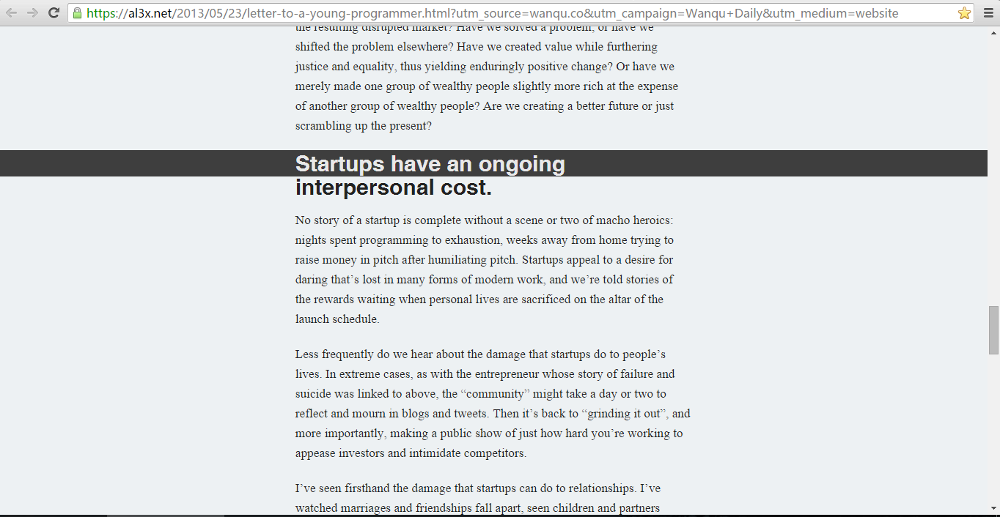
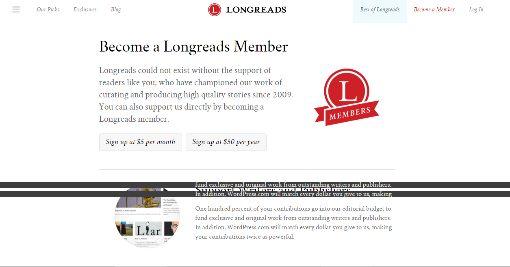

## (Chrome Extension)  Highlight One Line
[Install Highlight One Line](https://chrome.google.com/webstore/detail/highlight-single-line/iiidljfobkoinghhjkomjaiplnbchmdf)   

This Extenstion only focus on one thing: 
__highlight the line you click__     

Help you to track where did you just read.   

and even after you close the page, the extenstion still remember when did you just read.  
it would highlight the same line next time when you come back.   

__Note:__ there are many many website, they all have different layout,     
so __in some case this extenstion would break__, you should just disable the extenstion    
example:  
  

### if you have any suggestion
please open a issue on github, or email guokrfans#gmail.com     
Thanks    

 

---

### 这里是一个 Chrome 插件
这个插件只做一件事: 
__高亮你点击的那一行__  
这样等你切换回来就知道刚刚读到哪里了  
(是的, 随便框选一段文字的效果也一样, 所以装不装就看你喜好了)

 
#### 总结下 Chrome 插件的发布
1 进这里 https://chrome.google.com/webstore/developer/dashboard  填你项目的各种信息, 不过你现在还不能发布  
2 用信用卡给谷歌 5 美元, 这样就可以发布了   
3 如果上传 zip 压缩包报错, 那么把 manifest.json 里的注释全部删掉    

更多资料可以看: https://developer.chrome.com/webstore/publish
